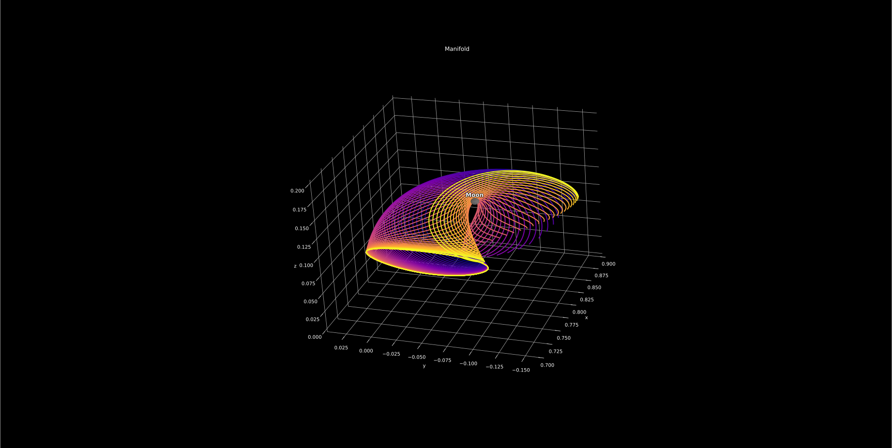
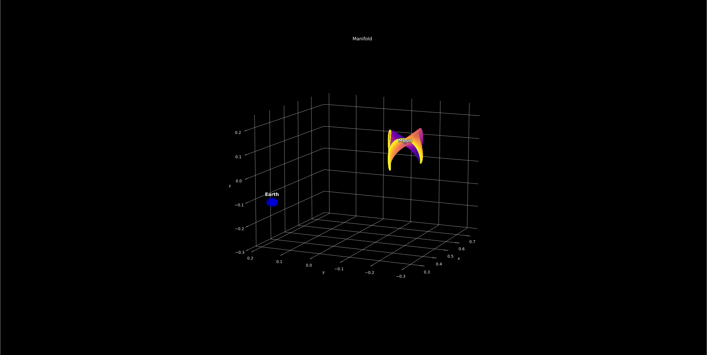
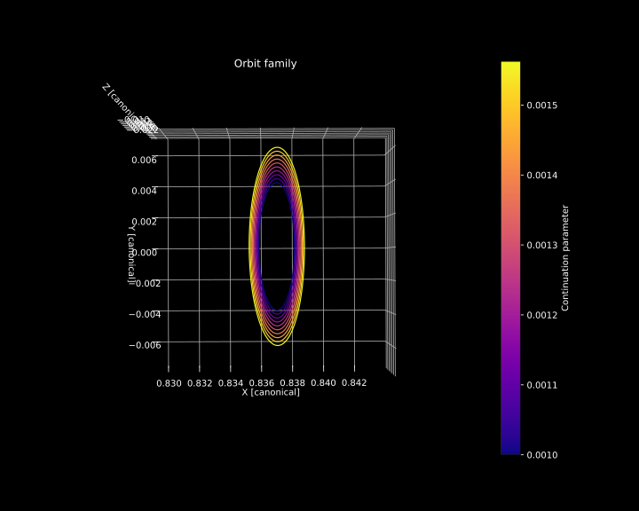
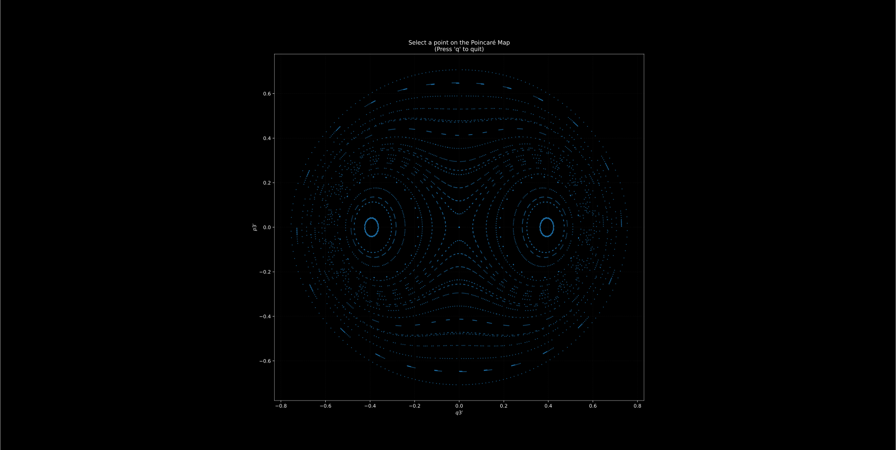

# HITEN - Computational Toolkit for the Circular Restricted Three-Body Problem

[](https://pypi.org/project/hiten/)

## Overview

**HITEN** is a research-oriented Python library that provides an extensible implementation of high-order analytical and numerical techniques for the circular restricted three-body problem (CR3BP).

## Examples

1. **Parameterisation of periodic orbits and their invariant manifolds**

   The toolkit constructs periodic solutions such as halo orbits and computes their stable and unstable manifolds.

   ```python
   from hiten import System

   system = System.from_bodies("earth", "moon")
   libration_point = system.get_libration_point(1)

   orbit = libration_point.create_orbit("halo", amplitude_z=0.2, zenith="southern")
   orbit.differential_correction(max_attempts=25)
   orbit.propagate(steps=1000)

   manifold = orbit.manifold(stable=True, direction="positive")
   manifold.compute()
   manifold.plot()
   ```

   

   *Figure&nbsp;1 - Stable manifold of an Earth-Moon \(L_1\) halo orbit.*

   Knowing the dynamics of the center manifold, initial conditions for vertical Lyapunov orbits can be computed and associated manifolds created. These reveal natural transport channels that can be exploited for low-energy mission design.

   ```python
   from hiten import System, VerticalLyapunovOrbit

   system = System.from_bodies("earth", "moon")
   libration_point = system.get_libration_point(1)

   cm = libration_point.get_center_manifold(max_degree=10)
   cm.compute()

   initial_state = cm.ic(poincare_point=[0.0, 0.0], energy=0.6, section_coord="q3")

   orbit = VerticalLyapunovOrbit(libration_point, initial_state=initial_state)
   orbit.differential_correction(max_attempts=100)
   orbit.propagate(steps=1000)

   manifold = orbit.manifold(stable=True, direction="positive")
   manifold.compute()
   manifold.plot()
   ```

   

   *Figure&nbsp;2 - Stable manifold of an Earth-Moon \(L_1\) vertical Lyapunov orbit.*

2. **Generating families of periodic orbits**

   The toolkit can generate families of periodic orbits by continuation.

   ```python
   from hiten import System
   from hiten.algorithms import NaturalParameter

    system = System.from_bodies("earth", "moon")
    l1 = system.get_libration_point(1)

    seed = l1.create_orbit('lyapunov', amplitude_x= 1e-3)
    seed.differential_correction(max_attempts=25)

    target_amp = 1e-2 # grow A_x from 0.02 to 0.05 (relative amplitude)
    current_amp = seed.amplitude
    num_orbits = 10

    # Step in amplitude space (predictor still tweaks X component)
    step = (target_amp - current_amp) / (num_orbits - 1)

    engine = NaturalParameter(
        initial_orbit=seed,
        state=(S.X),     # underlying coordinate that gets nudged
        amplitude=True,       # but the continuation parameter is A_x
        target=(current_amp, target_amp),
        step=step,
        corrector_kwargs=dict(max_attempts=50, tol=1e-13),
        max_orbits=num_orbits,
    )
    engine.run()

    family = OrbitFamily.from_engine(engine)
    family.propagate()
    family.plot()
    ```

    

    *Figure&nbsp;3 - Family of Earth-Moon \(L_1\) Lyapunov orbits.*

3. **Generating Poincaré maps**

   The toolkit can generate Poincaré maps for the centre manifold over various sections.

   ```python
   from hiten import System

   system = System.from_bodies("earth", "moon")
   l1 = system.get_libration_point(1)

   cm = l1.get_center_manifold(max_degree=12)
   cm.compute()

   pm = cm.poincare_map(energy=0.7, section_coord="q2", n_seeds=50, n_iter=100, seed_strategy="axis_aligned")
   pm.compute()
   pm.plot()
   ```

   

   *Figure&nbsp;4 - Poincaré map of the centre manifold of the Earth-Moon \(L_1\) libration point using the \(q_2=0\) section.*
